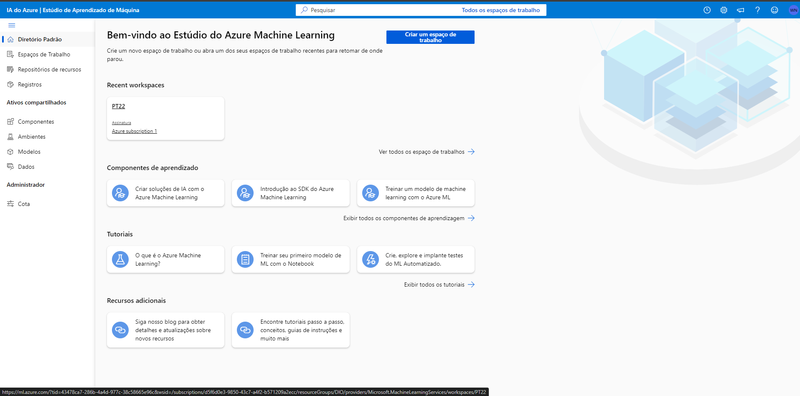
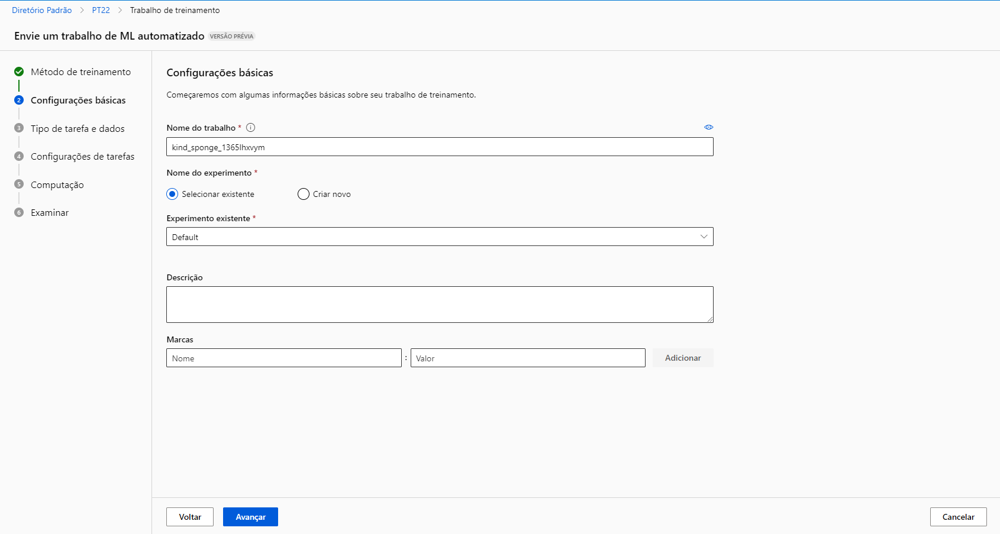
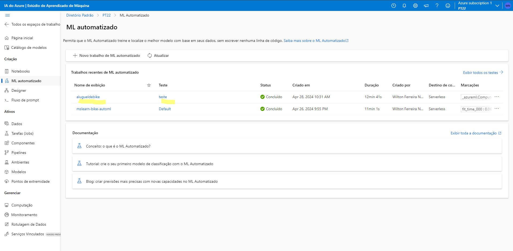
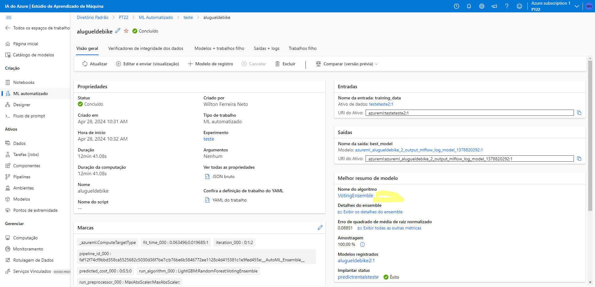
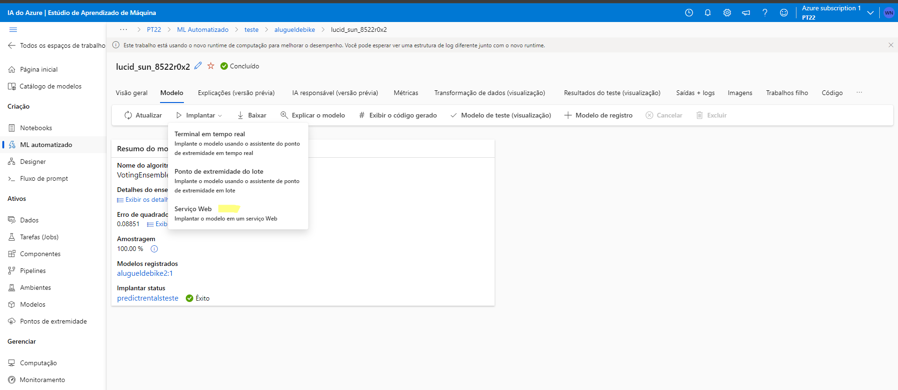
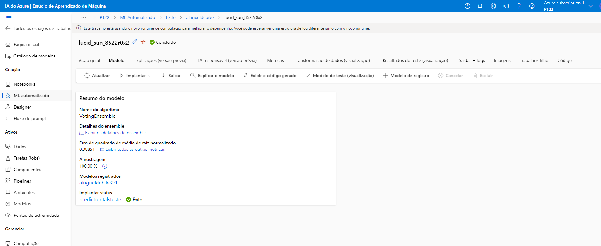
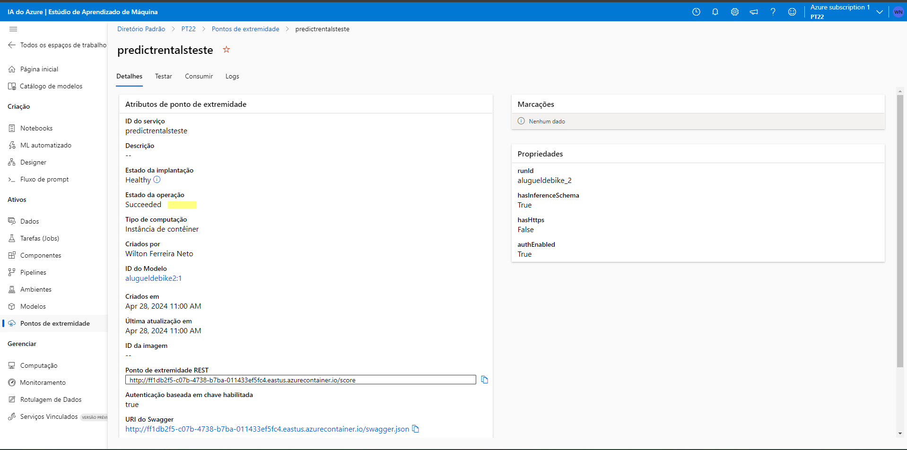
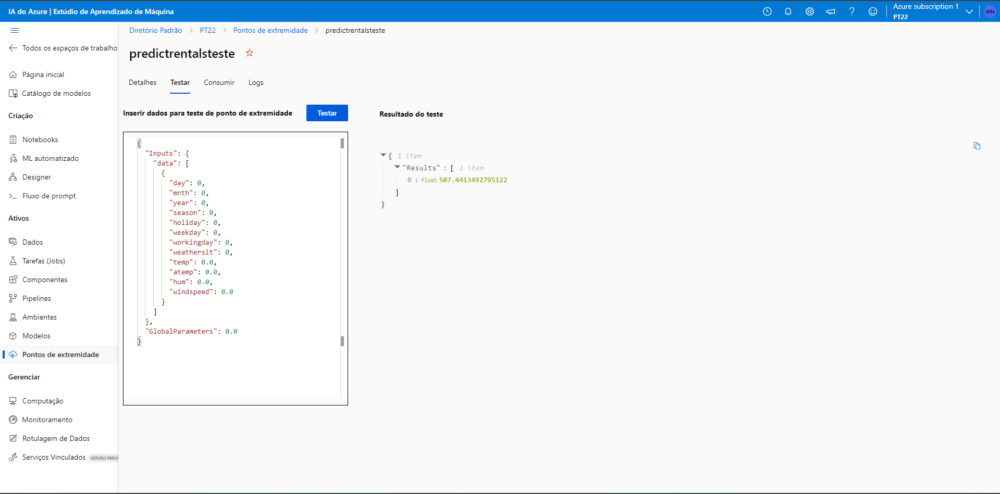

# INSTRUÇÕES ENTREGA DO PROJETO:
1. Crie um novo repositório no github com um nome a sua preferência
2. Crie um modelo de previsão com seus devidos pontos de extremidade configurados
3. Escreva o passo a passo desse processo em um readme.md de como você chegou nessa etapa
4. Salve nesse repositório o readme.md e o arquivo .json de pontos de extremidade
5. Compartilhe conosco o link desse repositório através do botão 'entregar projeto'

## 💻 RESUMO DA ATIVIDADE

- **1- Criar uma estação de trabalho**: Após criar uma conta no Azure, configurado, e também, ter já pré-definido uma estação de trabalho (Create a resourse), no azure stúdio, crie uma estação de trabalho, acesse esssa estação 
[]

- **2- Criar um novo ML Automatizado**: Para criar uma ML Automatizada, clique em (NOVO TRABALHO DE ML AUTOMATIZADO), e após isso, vai aparecer uma sequência de criação que é para ser seguida, conforme foi ensinado nas aulas
Exemplo: []

Após seguir esses passos, eu selecionei minha ML Automaizada criada:
 []

 Seguindo todos esses passos, após a conclusão da automatização do meu processo, verifiquei se estava tudo certo, após eu perceber que estava concluído o processo, acessei algorítimos (conforme a documentação do azure) para criar um modelo
  []

- **3- Criando um modelo**: Após configurar as Métricas como explicado na documentação do Azure, configurei conforme solicitado [], implatei o serviço para criar um modelo [] seguindo a regra da documentação

- **4- Testar+criação do ponto de extremidade**: Após minha implementação ser concluída [], acessei o ponto de extremidade [] ,e logo após, testei o meu modelo, conforme a documentação [], e com isso, hologrei éxito em testar a ML Automatizada

## LINKS

[]